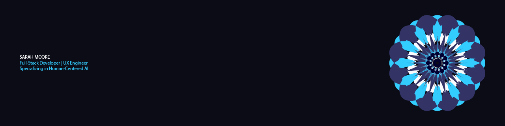

# Hi there, I'm Sarah Moore! 👋

I am a **Full-Stack Developer & UX Engineer** studying Graphic Information Technology (Full-Stack Web Development) at **Arizona State University**, with a deep focus on **Human-Centered AI Engineering**. I specialize in bridging the gap between robust software backends, intelligent models, and clean, accessible user experiences.

---

### 🚀 Technical Focus
- 🌐 **Full-Stack Engineering:** Developing modern, responsive web architectures with seamless backend and API integration.
- 🧠 **Human-Centered AI:** Designing intelligent systems focused on user interaction, interface clarity, and accessibility.
- 🎨 **Visual Systems:** Utilizing design systems, typography, and interactive components to create polished digital products.

### 🛠️ Tech Stack & Toolkit
- **Frontend / UX:** HTML5, CSS3, JavaScript, Responsive Web Design, Figma, Adobe Creative Cloud
- **Backend / AI:** Python, Node.js, SQL, RESTful APIs
- **Tools & Platforms:** Git, GitHub, Vercel

---

### 📂 Featured Projects
*   **[Portfolio Website](https://morriganpowers.com):** My central professional portfolio highlighting my latest full-stack developments, designs, and interactive elements.
*   **[The Camper](https://thecamperaguidetorvliving.com/):** A comprehensive guide and blogging platform dedicated to full-time RV living infrastructure and travel resources.

---

### 🌱 My Journey & Backstory
After a successful career as an Office Administrator in the financial sector, I stepped away in 2019 to travel full-time across the US in an RV. Immersing myself in new environments sparked a deep fascination with how people interact with technology remotely. 

This inspired me to return to academia to pursue software creation. I started my academic transition at Illinois College and later transferred to Arizona State University to specialize in Graphic Information Technology. My background gives me a unique advantage: I combine the organizational structure of an office admin, the adaptability of a full-time traveler, and the technical skill of a modern full-stack developer.

---

### 📫 Connect with Me
- 🌐 **Portfolio:** [morriganpowers.com](https://morriganpowers.com)
- 🚐 **Personal Blog:** [thecamperaguidetorvliving.com](https://thecamperaguidetorvliving.com/)
- 📧 **Personal Email:** saramorrigan.s@gmail.com
- 🎓 **School Email:** smmoor24@asu.edu
